### Escuela Colombiana de Ingeniería
### Arquitecturas de Software - ARSW
## Ejercicio Introducción al paralelismo - Hilos - Caso BlackListSearch

##### Integrantes 

- Juan Camilo Torres Suarez
- Valeria Bermudez Aguilar

### Descripción
Este ejercicio contiene una introducción a la programación con hilos en Java, además de la aplicación a un caso concreto.

## Parte I - Introducción a Hilos en Java**

1. De acuerdo con lo revisado en las lecturas, complete las clases CountThread, para que las mismas definan el ciclo de vida de un hilo que imprima por pantalla los números entre A y B.

- Según lo comprendido en las lecturas, en la clase **CountThreadMain** primero se definen los atributos inicio y fin, que representan el rango de números que recorrerá el hilo. Luego se crea el constructor, lo que hace este es que  recibe como parámetros el rango inicial y el rango final para inicializarlos  atributos. Por último, se sobrescribe el método run(), donde se crea un ciclo que recorre los valores desde el rango inicial hasta el rango final, ejecutando la tarea que se le da  al hilo.

2. Complete el método __main__ de la clase CountMainThreads para que:
    1. Cree 3 hilos de tipo CountThread, asignándole al primero el intervalo [0..99], al segundo [99..199], y al tercero [200..299].
         
         - Por otro lado, en la clase CountThread se encuentra el método main(), donde se crean los tres hilos con sus respectivos rangos de ejecución. Finalmente, se inicia cada uno de ellos mediante el método start()
    2. Inicie los tres hilos con 'start()'.
    3. Ejecute y revise la salida por pantalla.
       
    4. Cambie el incio con 'start()' por 'run()'. Cómo cambia la salida?, por qué?.
   
      
      - como podemos evidencial al momento de ejecutar los hilos con .start() el resultado se puede ver en desorden ya que  

## Parte II - Ejercicio Black List Search**

   1. Cree una clase de tipo Thread que represente el ciclo de vida de un hilo que haga la búsqueda de un segmento del conjunto de servidores disponibles. Agregue a dicha clase un método que permita 'preguntarle' a las instancias del mismo (los hilos) cuantas ocurrencias de servidores maliciosos ha encontrado o encontró.
    

   2. Agregue al método 'checkHost' un parámetro entero N, correspondiente al número de hilos entre los que se va a realizar la búsqueda (recuerde tener en cuenta si N es par o impar!). Modifique el código de este método para que divida el espacio de búsqueda entre las N partes indicadas, y paralelice la búsqueda a través de N hilos. Haga que dicha función espere hasta que los N hilos terminen de resolver su respectivo sub-problema, agregue las ocurrencias encontradas por cada hilo a la lista que retorna el método, y entonces calcule (sumando el total de ocurrencuas encontradas por cada hilo) si el número de ocurrencias es mayor o igual a BLACK_LIST_ALARM_COUNT. Si se da este caso, al final se DEBE reportar el host como confiable o no confiable, y mostrar el listado con los números de las listas negras respectivas. Para lograr este comportamiento de 'espera' revise el método join del API de concurrencia de Java. Tenga también en cuenta:

   Dentro del método checkHost Se debe mantener el LOG que informa, antes de retornar el resultado, el número de listas negras revisadas VS. el número de listas negras total (línea 60). Se debe garantizar que dicha información sea verídica bajo el nuevo esquema de procesamiento en paralelo planteado.

   Se sabe que el HOST 202.24.34.55 está reportado en listas negras de una forma más dispersa, y que el host 212.24.24.55 NO está en ninguna lista negra.
    
   

**Resultados** 

resulado primera prueba con 3 hilos.

resultado segunda prueba con 8 hilos

## Parte III - Evaluación de Desempeño**

A partir de lo anterior, implemente la siguiente secuencia de experimentos para realizar las validación de direcciones IP dispersas (por ejemplo 202.24.34.55), tomando los tiempos de ejecución de los mismos (asegúrese de hacerlos en la misma máquina):

1. Un solo hilo.
2. Tantos hilos como núcleos de procesamiento (haga que el programa determine esto haciendo uso del [API Runtime](https://docs.oracle.com/javase/7/docs/api/java/lang/Runtime.html)).
3. Tantos hilos como el doble de núcleos de procesamiento.
4. 50 hilos.
5. 100 hilos.

Para esta parte se realizaron 5 pruebas de ejecución usando el host disperso `202.24.34.55`, variando el número de hilos (N), y se midió el tiempo de ejecución reportado por el propio programa. Las pruebas se hicieron todas en la misma máquina (procesador AMD A12-9730P, 4 núcleos), y en paralelo se usó jVisualVM para observar el comportamiento de CPU y memoria durante cada corrida.

Para esta parte se realizaron 5 pruebas de ejecución usando el host disperso `202.24.34.55`, variando el número de hilos (N), y se midió el tiempo de ejecución reportado por el propio programa. Las pruebas se hicieron todas en la misma máquina (procesador AMD A12-9730P, 4 núcleos), y en paralelo se usó jVisualVM para observar el comportamiento de CPU y memoria durante cada corrida.

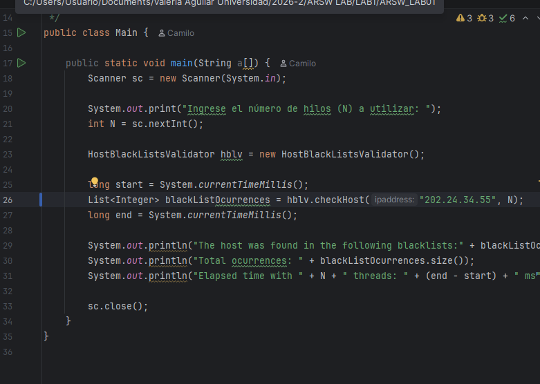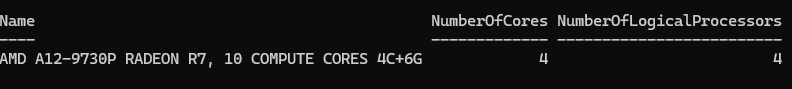

Antes de correr el programa, en la lista de "Local" de jVisualVM solo aparece el proceso de IntelliJ IDEA, ya que aún no se había ejecutado nuestro programa

Al correr `Main.java`, jVisualVM detecta automáticamente el nuevo proceso `edu.eci.arsw.blacklistvalidator.Main`, con un PID distinto al de IntelliJ. Ese es el proceso que se monitoreó durante cada prueba.
 
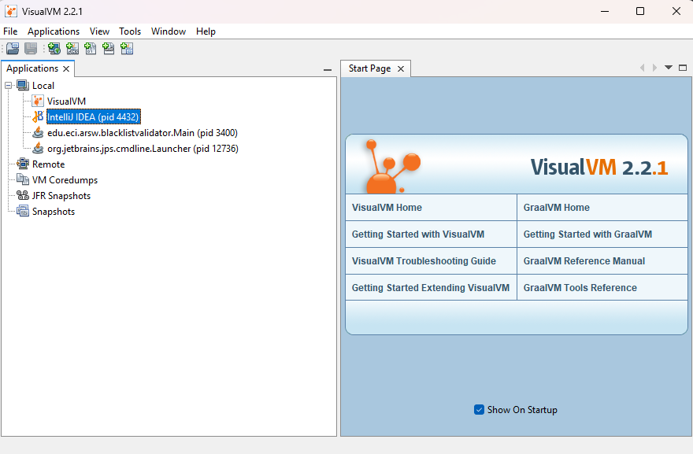

**Prueba 1: N = 1 hilo**

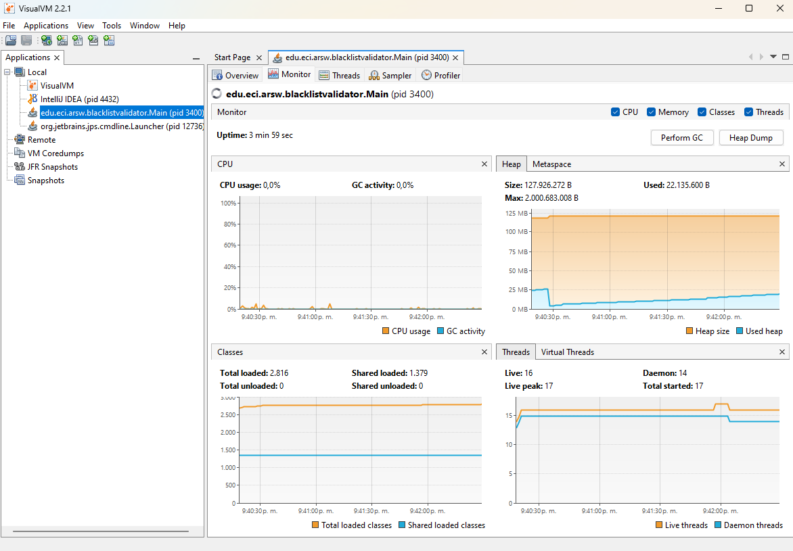

Después de ingresar `1` como número de hilos, se ve un pequeño pico en la gráfica de CPU. Como solo se usa un hilo, el consumo de CPU es bajo, ya que solo se aprovecha uno de los 4 núcleos disponibles.

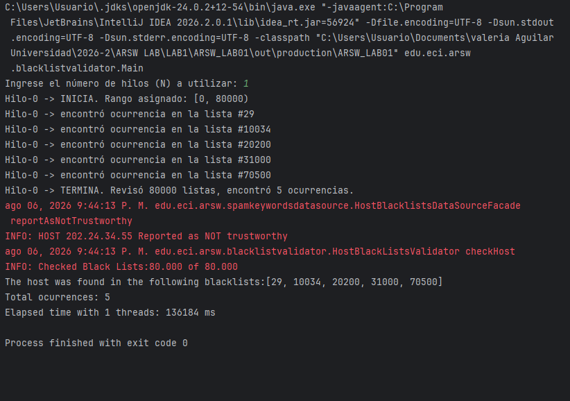

En el log completo de esta ejecución se puede ver que el único hilo (`Hilo-0`) revisó las 80000 listas negras completas, encontró las 5 ocurrencias esperadas en las listas #29, #10034, #20200, #31000 y #70500, y reportó el host como no confiable. El tiempo total fue de **136184 ms**.

**Prueba 2: N = 4 hilos (núcleos)**

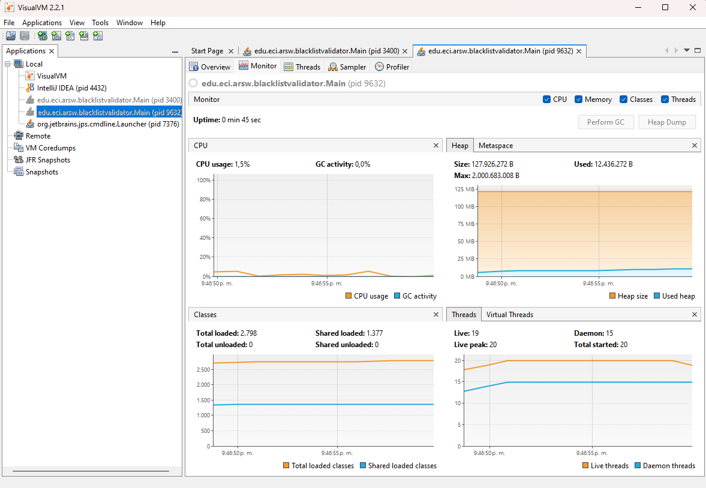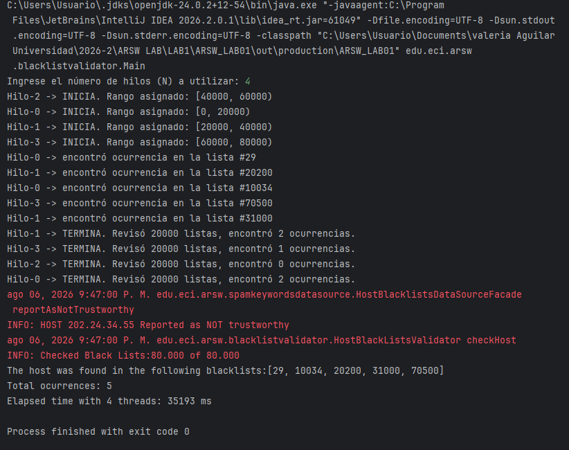

Con 4 hilos, el trabajo se repartió en rangos de 20000 listas por hilo (80000÷4). Cada hilo encontró parte de las 5 ocurrencias totales. El tiempo bajó a **35193 ms**, casi 4 veces más rápido que con 1 solo hilo, lo cual tiene sentido porque el procesador usado tiene exactamente 4 núcleos.

**Prueba 3: N = 8 hilos (2 x núcleos)**

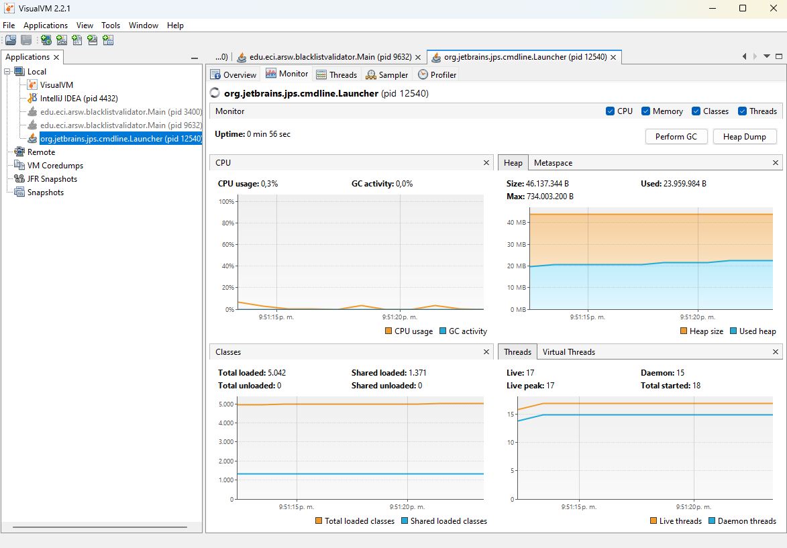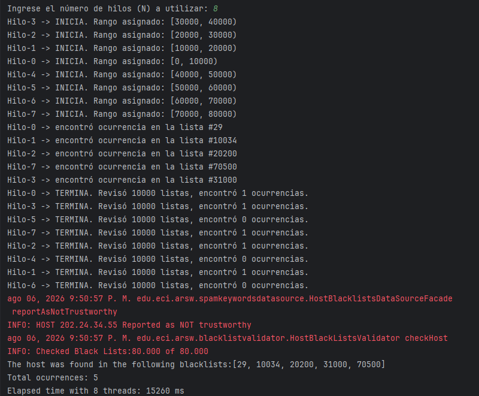

En esta prueba el tiempo bajó a **15260 ms**. Aquí ya se usó el doble de hilos que de núcleos, así que cada núcleo tuvo que turnarse entre 2 hilos. Aun así el tiempo siguió bajando, porque cada validación de host tiene una pequeña pausa simulada, y mientras un hilo está en esa pausa el sistema aprovecha para atender a otro hilo.

**Prueba 4: N = 50 hilos**

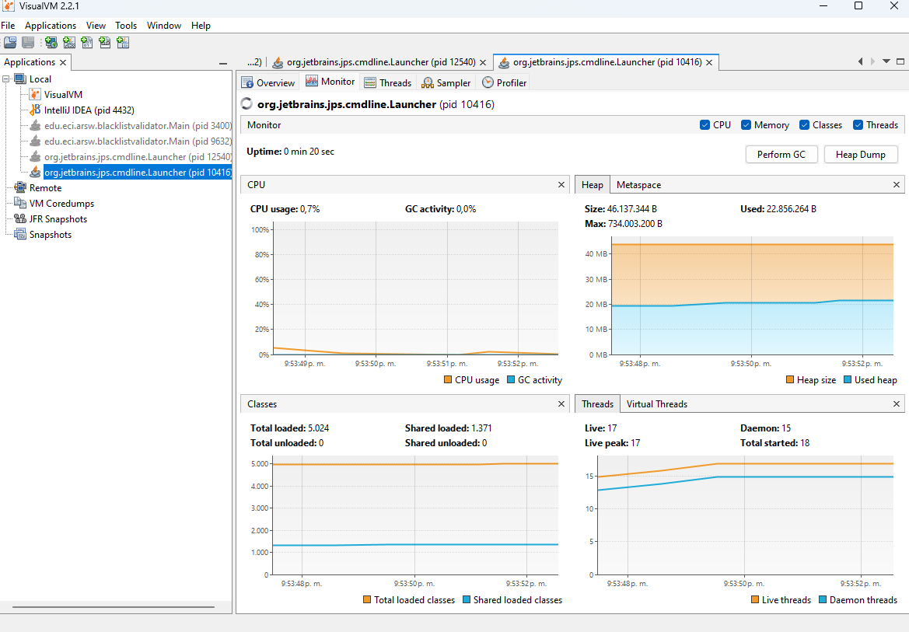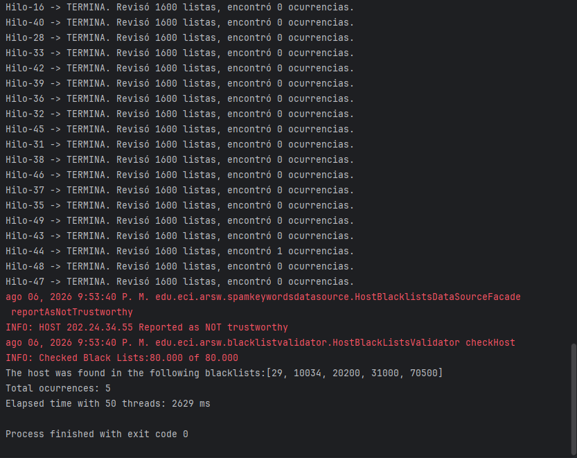

**Prueba 5: N = 100 hilos**

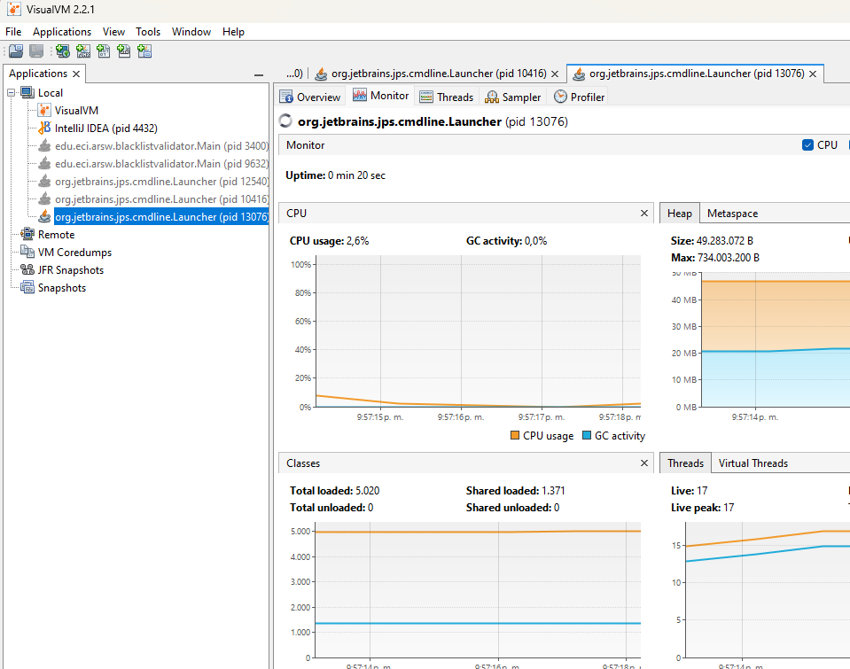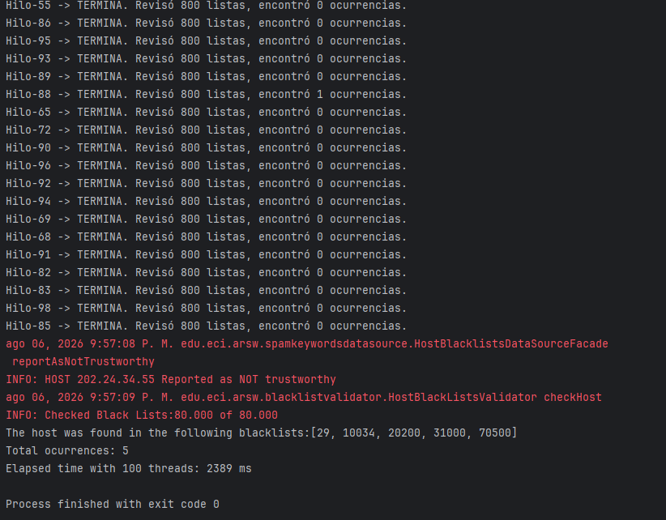

Finalmente, con 100 hilos el tiempo fue de **2389 ms**, muy parecido al de 50 hilos. Aquí se ve claramente que agregar más hilos ya casi no mejora el desempeño: se llega a un punto donde el cuello de botella deja de ser el número de hilos y pasa a ser el número de núcleos reales del procesador.

**Tabla de resultados**

| Hilos           | Tiempo (ms) | Speedup vs. 1 hilo |
|-----------------|-------------|---------------------|
| 1               | 136184      | 1x                  |
| 4 (núcleos)     | 35193       | 3.87x               |
| 8 (2x núcleos)  | 15260       | 8.93x               |
| 50              | 2629        | 51.8x               |
| 100             | 2389        | 57x                 |

**Gráfica: tiempo de solución vs. número de hilos**

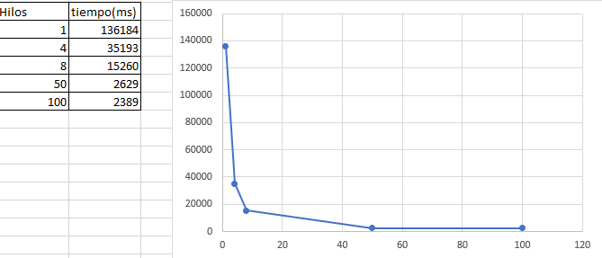

**Análisis**

Con estos resultados se puede ver que el tiempo de ejecución disminuye mucho al principio, sobre todo al pasar de 1 a 8 hilos. Después la mejora ya no es tan grande; por ejemplo, entre 50 y 100 hilos el tiempo solo baja de 2629 ms a 2389 ms, aunque se haya duplicado la cantidad de hilos.

Esto tiene sentido porque el computador tiene 4 núcleos físicos, así que solo puede ejecutar 4 hilos al mismo tiempo. Los demás deben esperar, por lo que llega un punto en el que agregar más hilos ya no mejora tanto el rendimiento.

Sin embargo, nos llamó la atención que al pasar de 8 a 50 hilos todavía hubiera una mejora considerable. Creemos que esto ocurre porque cada validación tiene una pequeña pausa simulada. Mientras un hilo está esperando, el procesador puede ejecutar otro, aprovechando mejor el tiempo disponible. Por eso, en este caso, usar más hilos que núcleos sigue dando buenos resultados hasta cierto límite.

También vimos que pasar de 4 a 8 hilos redujo el tiempo de 35193 ms a 15260 ms. Esto muestra que, para este laboratorio, duplicar el número de hilos respecto a los núcleos todavía aporta una mejora importante.

Finalmente, si en lugar de ejecutar 100 hilos en un solo computador se usaran 100 computadores con un hilo cada uno, el paralelismo sería mayor porque cada hilo tendría su propio procesador. Sin embargo, aparecerían otros costos, como la comunicación entre las máquinas y la sincronización de los resultados, que en este laboratorio no tuvimos porque todo se ejecutó en un mismo equipo.

## Parte IV - Ejercicio Black List Search

#### 1. Según la ley de Amdahl

La ley de Amdahl establece que el rendimiento no mejora indefinidamente al aumentar el número de hilos, ya que siempre existe una parte del programa que no puede ejecutarse en paralelo. En nuestro caso, el computador cuenta con 4 núcleos físicos, por lo que crear 200 o 500 hilos no significa que todos puedan ejecutarse al mismo tiempo. A partir de cierto punto, los hilos adicionales solo esperan su turno y generan más cambios , por lo que la mejora es cada vez menor, por eso  el desempeño con 500 hilos es muy similar al obtenido con 200 hilos y la diferencia en el tiempo de ejecución es mínima.

#### 2. Comparación entre usar tantos hilos como núcleos y usar el doble

Durante el laboratorio observamos que utilizar el doble de hilos que de núcleos sí mejoró el rendimiento. Al pasar de 4 a 8 hilos el tiempo de ejecución disminuyó considerablemente. Esto ocurre porque cada validación incluye una pequeña pausa simulada; mientras un hilo está esperando, el sistema operativo puede ejecutar otro y aprovechar mejor el procesador. Sin embargo, esta mejora solo se mantiene hasta cierto punto, ya que al seguir aumentando la cantidad de hilos el beneficio empieza a disminuir.

#### 3. Uso de múltiples máquinas

Si en lugar de ejecutar 100 hilos en un solo computador se utilizaran 100 máquinas, cada una ejecutando un único hilo, el paralelismo sería mayor porque cada hilo tendría su propio procesador y no tendría que competir por los mismos núcleos. En este escenario, el comportamiento estaría más cerca del ideal planteado por la ley de Amdahl.

Si, en cambio, se utilizaran **c** hilos distribuidos en **100/c** máquinas, también se obtendría una mejora, siempre que cada máquina tenga suficientes núcleos para ejecutarlos. No obstante, aparecería un costo adicional asociado a la comunicación entre las máquinas y a la sincronización de los resultados, algo que no ocurre cuando toda la ejecución se realiza en un único computador con memoria compartida.

## Bibliografia

- Amdahl, G. M. (1967). *Validity of the single processor approach to achieving large scale computing capabilities*. AFIPS Conference Proceedings, 30, 483–485. https://doi.org/10.1145/1465482.1465560

- Goetz, B., Peierls, T., Bloch, J., Bowbeer, J., Holmes, D., & Lea, D. (2006). *Java Concurrency in Practice*. Addison-Wesley Professional.

- HowToDoInJava. (2023). *wait(), notify() and notifyAll() Methods in Java*. https://howtodoinjava.com/java/multi-threading/wait-notify-and-notifyall-methods/